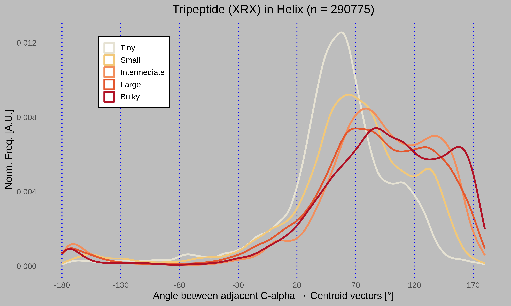

# Tripeptide Side-Chain Angle Pipeline

This pipeline computes signed side-chain orientation angles for tripeptide contexts (XRX in helix) across a set of PDB structures. Starting from `.pdb.gz` files, it runs STRIDE for secondary structure assignment, extracts tripeptide contexts, calculates angles between adjacent CA→Centroid vectors, and plots the distribution grouped by the size class of the left residue.

## Example Output



## Requirements

This pipeline assumes you have the following already installed and accessible in your environment:

- Python 3.10+
- Snakemake
- STRIDE
- R

Python dependencies:

```bash
pip install -r requirements.txt
```

R dependencies:

```R
install.packages(c("ggplot2", "dplyr", "readr"))
```

## How to Run

```bash
chmod +x run_pipeline.sh
./run_pipeline.sh [pdbs_dir] [stride_binary]
```

Both arguments are optional. Defaults are `pdbs/` for the PDB directory and `stride` (system PATH) for the STRIDE binary.

Example with custom paths:

```bash
./run_pipeline.sh pdb_files /usr/local/bin/stride
```

This will produce `final/angles.tsv` and `final/angle_plot.png`.

## Re-plot from Existing angles.tsv

If you already have `final/angles.tsv` and just want to regenerate the plot:

```bash
Rscript scripts/plot_angles.R
```

## File Structure

```
project/
├── run_pipeline.sh
├── config.yaml
├── requirements.txt
├── pdbs/                        # input .pdb.gz files
├── secondary_structure_analysis.smk
├── create_context_tsv.smk
├── angle_pipeline.smk
├── scripts/
│   ├── extract_context.py
│   ├── calculate_angles.py
│   └── plot_angles.R
├── stride_out/                  # generated .ss.out
├── contexts/                    # generated context TSV
└── final/
    ├── angles.tsv
    └── angle_plot.png
```
